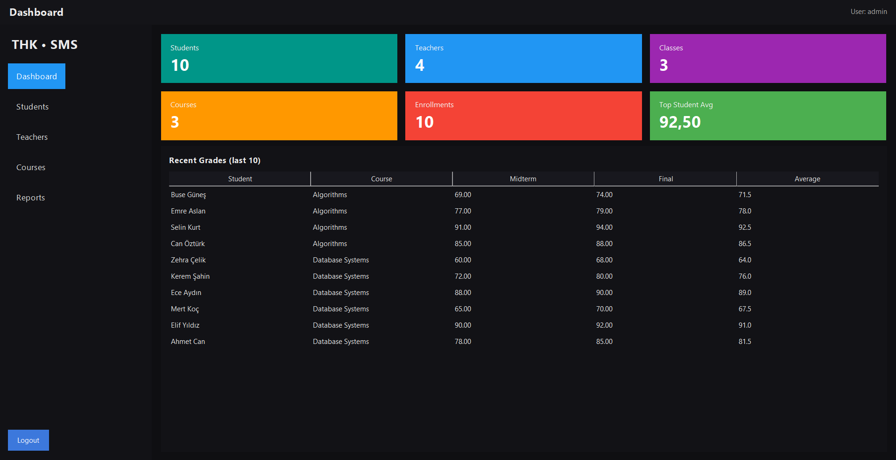
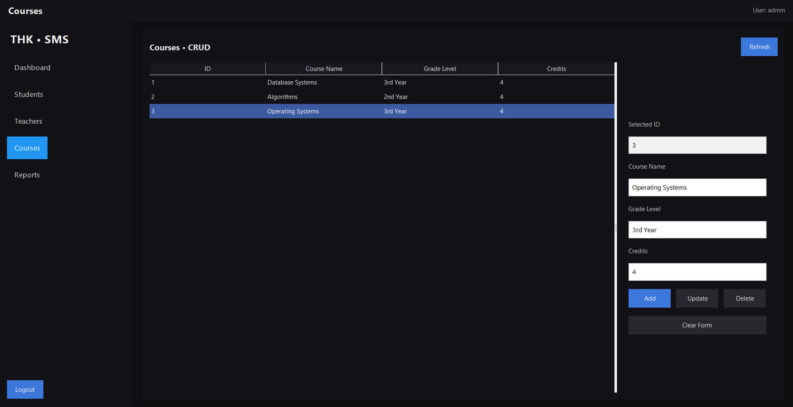
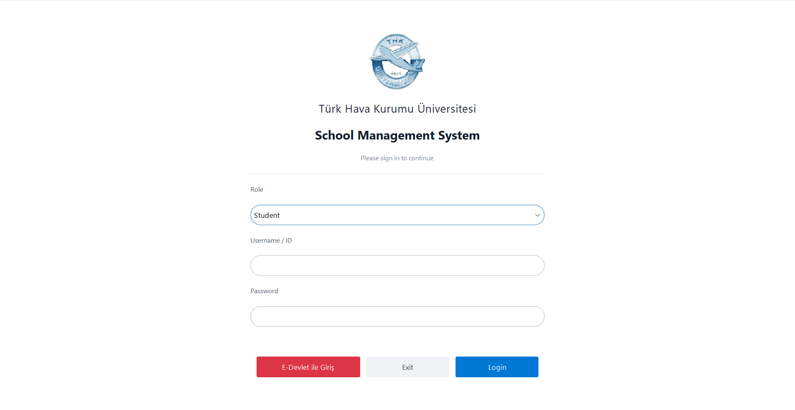
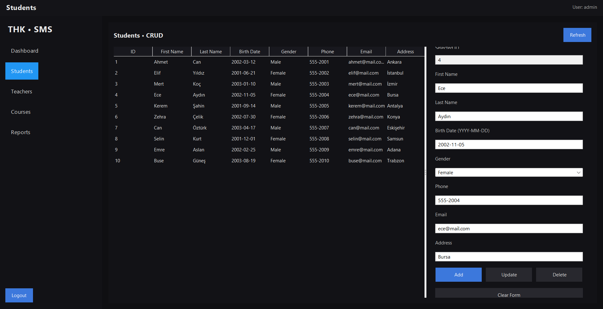

# School Management System (SMS)

School Management System is a full-featured Java Swing desktop application designed
to manage core academic operations such as students, teachers, courses, grades,
and attendance. The project demonstrates clean software architecture, SQL-based
data management, and a modern desktop user interface.

The system is built with a layered approach, separating user interface logic,
business logic, and database access to ensure maintainability and scalability.

---

## Key Features
- Role-based authentication (Admin, Teacher, Student)
- Full CRUD operations for academic entities
- Stored procedures for reporting and aggregation
- Dashboard with real-time statistics
- Data visualization using charts
- Modular and maintainable code structure

---

## System Architecture
The application follows a layered architecture:

- **UI Layer**  
  Java Swing components styled with FlatLaf

- **Backend Layer**  
  Java with JDBC using the DAO pattern

- **Database Layer**  
  MySQL with foreign keys and stored procedures

This separation ensures that UI, business logic, and database concerns are handled
independently.

---

## Technologies Used

### Backend
- Java 23
- JDBC
- DAO Pattern

### User Interface
- Java Swing
- FlatLaf (Modern Look & Feel)

### Database
- MySQL 8.x
- Stored Procedures
- Foreign Key Constraints

### Visualization
- JFreeChart

---

## Database Design
The database schema is designed to represent real-world academic relationships.

Main entities:
- Student
- Teacher
- Course
- Class
- Enrollment
- Grade
- Attendance
- UserAccount

Design considerations:
- Proper use of primary and foreign keys
- Referential integrity enforcement
- Many-to-many relationships resolved via the Enrollment table

---

## Stored Procedures
Stored procedures are used to perform advanced queries and generate reports efficiently.

Examples:
- GetStudentGrades
- GetTopStudent
- GetHighestFinal
- GetTeacherClasses
- GetClassAverage

---

## User Interface

### Login Screen
Role-based authentication for Student, Teacher, and Admin users.
The interface uses a clean and modern Swing layout styled with FlatLaf.

---

### Dashboard
The dashboard provides an overview of the system, including:
- Total number of students
- Total number of teachers
- Total number of courses
- Total enrollments
- Top student average

Recent grades are displayed in a table, and summary statistics are presented
using visual components.

---

### Students Management
The students management screen provides full CRUD functionality for student records.
It allows administrators to manage personal and academic information through a
table-based view combined with a structured form panel.

Features include:
- Viewing all registered students
- Adding new student records
- Updating existing information
- Deleting student entries
- Real-time table refresh after operations

---

### Teachers Management
CRUD operations for teacher records, including personal and academic information.
The interface supports record selection, real-time updates, and form-based editing.

---

### Courses Management
A full CRUD interface for managing courses.
The screen includes a table view for existing records and a form panel for
adding, updating, and deleting courses.

---

## Security Note
Database credentials are intentionally omitted from the repository for security reasons.
Users should update the database username and password in the connection class
before running the application.

---

## How to Run
1. Import the project into IntelliJ IDEA
2. Set up a MySQL database
3. Execute the provided SQL scripts to create tables and stored procedures
4. Update database credentials in `DBConnection.java`
5. Run `Main.java`

---

## Why This Project?
This project was built to demonstrate:
- Java desktop application development
- SQL database design and optimization
- Clean separation of concerns
- Practical use of Swing in a real-world scenario

